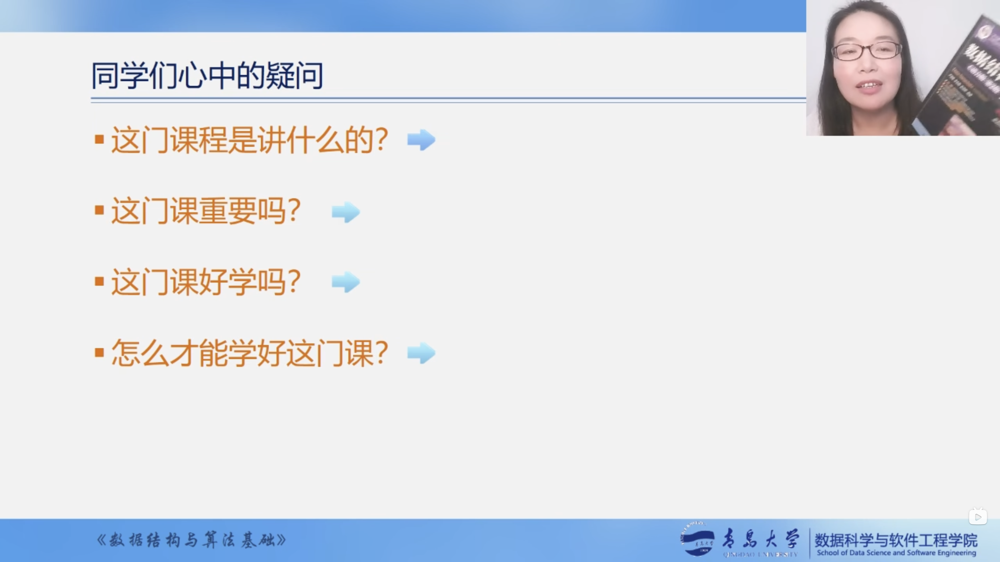
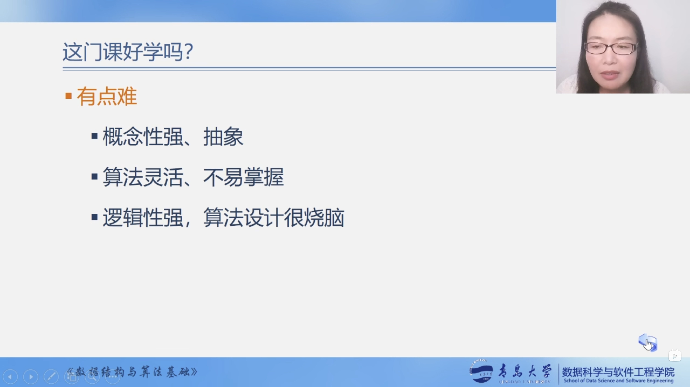
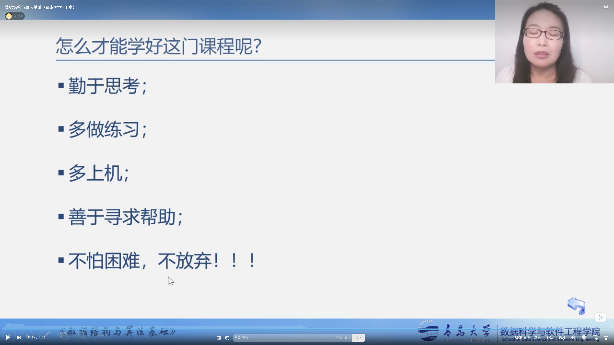

# 数据结构与算法（青岛大学-王卓老师）

## 同学们心中的疑问

## 课程内容

## 目录

* 第1章 绪论
  * [1.1 数据结构的研究内容](docs/charpter-1/1.1-数据结构的研究内容.md)
  * [1.2 基本概念和术语](docs/charpter-1/1.2-基本概念和术语.md)
  * [1.4 算法和算法分析](docs/charpter-1/1.4-算法和算法分析.md)

## 地位

## 重要性

## 好学吗

## 如何学

