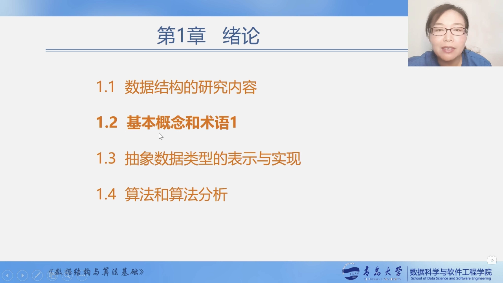
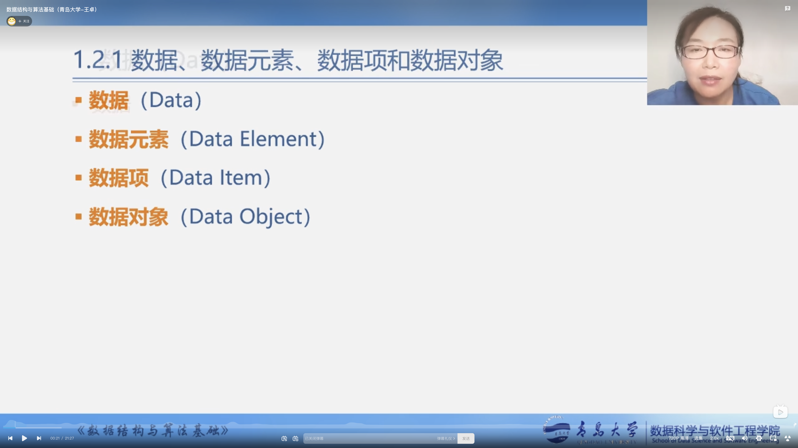
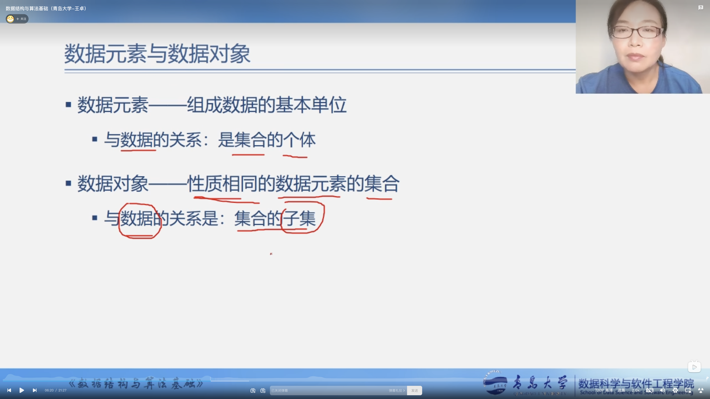
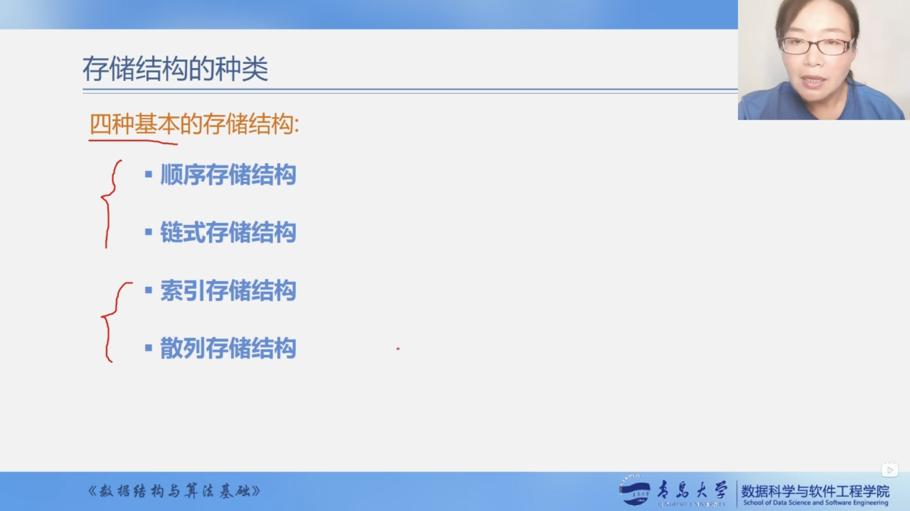

# 基本概念和术语1



## 数据、数据元素、数据项和数据对象



### 数据（Data）


**数据**是能输入计算机且能被计算机程序处理的**各种符号的集合**。

* 信息的载体
* 是对客观事物符号化的表示
* 能够被计算机识别、存储和加工

包括：

* 数值型的数据：整数、实数等
* 非数值型的数据：文字、图像、图形、声音等

### 数据元素（Data element）和数据项


* 数据元素
  * 是数据的**基本单位**，在计算机程序中通常作为一个整体进行考虑和处理。
  * 也简称为元素，或称为记录、结点或顶点。
  * 一个**数据元素**由若干个**数据项（Data Item）**组成。

### 数据项


**数据项**是构成数据元素的不可分割的**最小单位**。

数据、数据元素、数据项三者之间的关系：

```
数据 > 数据元素 > 数据项
```

### 数据对象


*数据对象*是**性质相同的数据元素的集合**，是数据的一个子集。

例如：
* **整数**数据对象是集合N={0,±1，±2, ...}
* **字母字符**数据对象是集合C={'A','B',...,'Z'}
* **学籍表**也可看作一个数据对象

### 数据元素现数据对象



* 数据元素——组成数据的基本单位
  * 与数据的关系：是集体的个体
* 数据对象——性质相同的数据元素的集合
  * 与数据的关系：集合的子集

## 数据结构（Data Structure）


* 数据结构
  * 数据元素不是孤立存在的，它们之间存在着某种关系，**数据元素相互之间的关系称为结构（Structure）**
  * 是指**相互之间存在一种或多种特定关系**的数据元素集合
  * 或者说，数据结构是**带结构的**数据元素的集合


数据结构包括以下三个方面的内容

1. 数据元素裸的逻辑关系，也称为**逻辑结构**。
2. 数据元素及其关系在计算机内存中的表示（又称为映像），称为数据的**物理结构**或数据的**存储结构**。
3. 数据的**运算和实现**，即对数据元素可以施加的操作以及这些操作在相应的存储结构上的实现。

### 数据结构的两个层次


### 逻辑结构的种类


### 存储结构的种类




