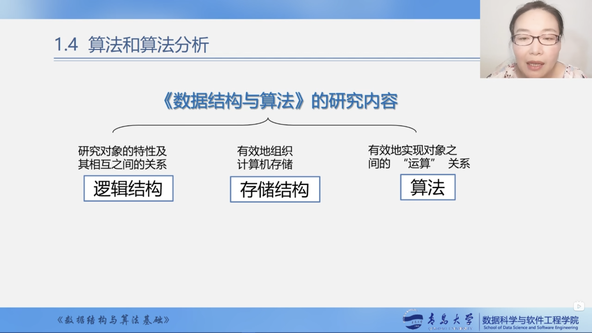
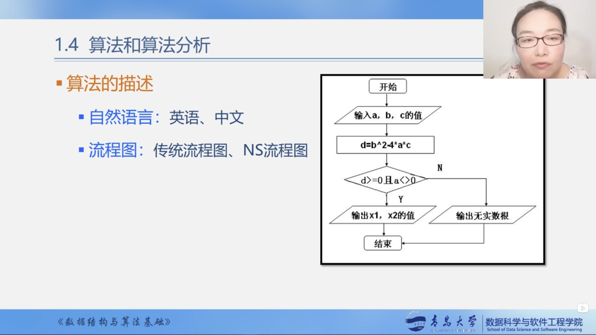
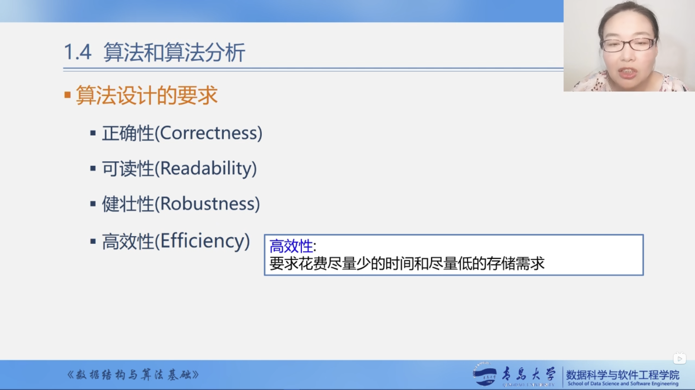

# 1.4 算法和算法分析

## 算法

### 算法的定义

对特定问题求解方法和步骤的一种描述，它是**指令**的有限**序列**。其中每个指令表示一个或多个操作。

### 算法的描述

* 自然语言： 英语、中文等

* 流程图：传统流程图、NS流程图

* 伪代码：类语言：类C语言
* 程序代码：C、C++、Java、Python等

### 算法与程序

### 算法特性

### 算法设计的要求

* 正确性（Correctness）

* 可读性（Readability）

* 健壮性（Robustness）

* 高效性（Efficiency）

## 算法分析

### 时间效率

